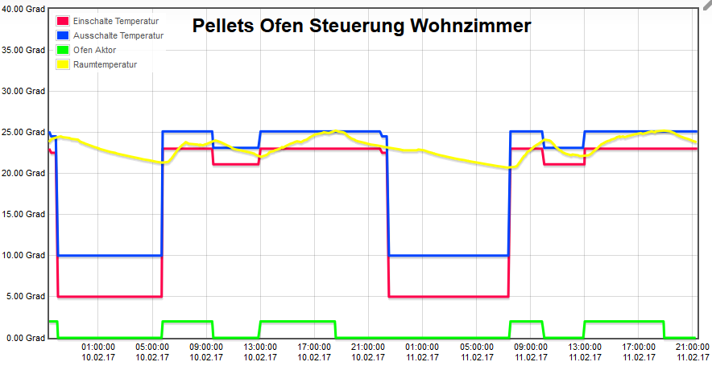
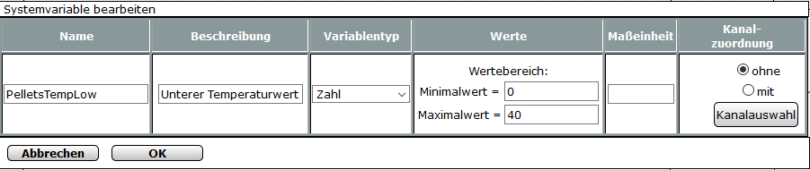
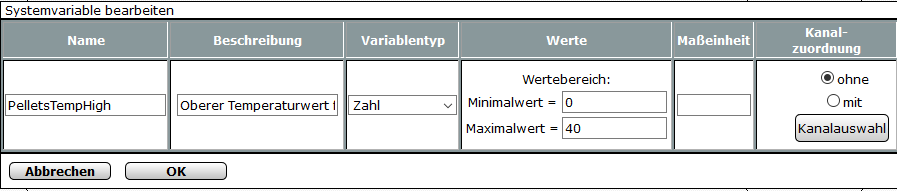
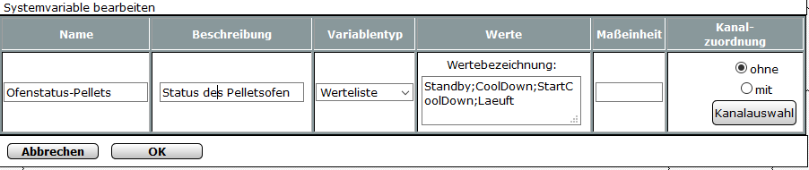
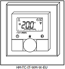
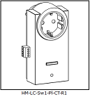
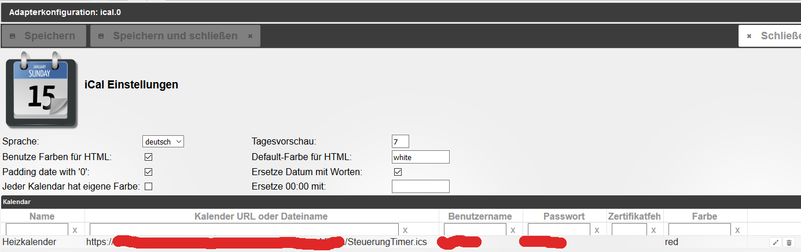

# Pelletsofen steuern mit Homematic & IoBroker

Steuert einen Pelletsofen anhand einer Schaltzeittabelle nach Temperaturvorgaben.

Die Schaltzeiten und die Temperaturvorgaben können durch eine Kalenderfunktion 'uebersteuert' werden, so dass durch setzen eines Termins die Schaltzeittabelle ausser Kraft gesetzt wird.

Um die Default Schaltzeiten zu uebersteuern, legt man im entsprechenden Kalender Termine an, die folgenden Text enthalten:

| Termin        | Aktion                                   |
| ------------- | ---------------------------------------- |
| PelletsOFF    | Fuer die Dauer dieses Termins, wird nach dem Temperaturprofil **PelletsOFF** gesteuert |
| PelletsHIGH   | Fuer die Dauer dieses Termins, wird nach dem Temperaturprofil **PelletsHIGH** gesteuert |
| PelletsMIDDLE | Fuer die Dauer dieses Termins, wird nach dem Temperaturprofil **PelletsMIDDLE** gesteuert |
| PelletsEND    | Fuer die Dauer dieses Termins, wird nach dem Temperaturprofil **PelletsEND** gesteuert |

- Ist man eine Woche nicht zu Hause, erstellt man einfach einen Termin mit dem Namen PelletsOFF
- hat man naechste Woche Fruehschicht erstellt man einen Termin mit dem Namen PelletsOn, damit man es Warm hat, wenn man nach Hause kommt.

So sehen die Verlaeufe aus bei Automatik Betrieb

------

##Inhaltsverzeichnis

- [Benoetigte Hard/Software](#benoetigte-hard/software)
- [Homematic einrichten](#homematic-einrichten)
  - [Systemvariable einrichten](#systemvariable-einrichten)
    - [PelletsTempLow](#systemvariable-pelletstemplow-einrichten)
    - [PelletsTempHigh](#systemvariable-pelletstemphigh-einrichten)
    - [OfenstatusPellets](#systemvariable-ofenstatuspellets-einrichten)
    - [Pelletsheizung](#systemvariable-pelletsheizung-einrichten)
  - [Sensor fuer Raumtemperatur](#sensor-fuer-raumtemperatur)
  - [Aktor zur Ofensteuerung](#aktor-zur-ofensteuerung)
  - [Programme auf der Homematic](#programme-auf-der-homematic)
    - [Pelletsofen Safety Shutdown](#pelletsofen-safety-shutdown)
    - [Pelletsofen nach Heizstatus steuern](#pelletsofen-nach-heizstatus-steuern)
    - [Pelletsofen nach Raumtemperatur steuern](#pelletsofen-nach-raumtemperatur-steuern)
    - [Pelletsofen CoolDown starten](#pelletsofen-cooldown-starten)
    - [Pelletsofen Fernbedienung](#pelletsofen-fernbedienung-(optional))
- [IO-Broker einrichten](#io-broker-einrichten)
  - [ICAL Adapter einrichten](#ical-adapter-einrichten)
  - [Script installieren und anpassen](#script-installieren-und-anpassen)
  - [Hinweise zum Script](#hinweise-zum-script)
- [History](#history)

------

## Benoetigte Hard/Software

- Homematic CCU (auf CCU2 getestet)
- IO-Broker mit ...
- - Java-Script Adapter
- - ical-Adapter
- - entsprechende Homamatic-Adapter
- ics Kalender auf Google, Netzlaufwerk oder ähnlichem
- Pelletsofen mit Schalteingang
- Temperaturfuehler für Homematic
- Schaltaktor mit Potentialfreiem Ausgang

## Homematic einrichten
Auf der Homematic muessen die erforderlichen Systemvariable erstellt werden, welche von IO-Broker gesteuert werden und einige Programme, welche die eigentliche Steuerung uebernehmen. Der eine oder andere wird sich jetzt sicher fragen, warum die Arbeit auf 2 Systeme verteilt wird, das hat folgende Gruende:

1. Die Steuerung  sollte auch dann funktionieren, wenn IO-Broker offline ist (in dem Fall nach dem zuletzt gesetzten Temeraturprofil)
2. Sicherheitsfunktionen auf der Homematic sollen immer greifen und das toggeln (Ein/Aus) des Pelletsofen wirkungsvoll verhindern, denn dies wuerde über kurz oder lang den Ofen beschaedigen.
3. Die Homematic sitzt einfach dem Schaltadapter naeher, kein Netzwerk das ausfallen könnte.

### Systemvariable einrichten

Die Temperaturwerte nach denen der Pelletsofen gesteuert wird, muessen als erstes in der Homematic eingerichtet werden, dazu werden die zwei System-Variablen in der Homematic mit folgenden Werten erzeugt:

#### Systemvariable PelletsTempLow einrichten

#### Systemvariable PelletsTempHigh einrichten

Danach muessen folgende Systemvariablen fuer die eigentliche Steuerung angelegt werden:
#### Systemvariable OfenstatusPellets einrichten

| Wert          | Bedeutung                                |
| :------------ | :--------------------------------------- |
| Standby       | Ofen kann bei Bedarf gezündet werden und ist Betriebsbereit |
| CoolDown      | Ofen wurde abgeschaltet und kühlt runter, min. 90 Minuten |
| StartCooldown | Statuswechsel in CoolDown                |
| Laeuft        | Ofen ist eingeschaltet                   |

#### Systemvariable Pelletsheizung einrichten

| Wert    | Bedeutung                                |
| :------ | :--------------------------------------- |
| Aus     | Ofensteuerung ist aus, Aktor ist abgeschaltet |
| Auto    | Automatische Steuerung ist aktiv         |
| Manuell | Manueller Betrieb, Aktor ist eingeschaltet |

### Sensor fuer Raumtemperatur

Als Sensor fuer die Raumtemperatur verwende ich in diesem Fall einen `HM-TC-IT-WM-W-EU`.

Der Geraete-Name ist hier `Wand-Wohnzimmer` . Der Temperatursensor selbst wurde als `Wand-Wohnzimmer-TempSensor` in der Geraeteeinstellung definiert. <u>**Wichtig!**</u> Wenn euer Temperatursensor den ihr verwenden wollt anders heisst, muesst ihr die Bezeichnung in allen Homematic-Programmen und auch in den Homematic-Scripten dementsprechend fehlerfrei anpassen, im IO-Broker script ist dafuer keine Anpassung noetig.

### Aktor zur Ofensteuerung

Als Aktor fuer die Ofensteuerung verwende ich einen `HM-LC-Sw1-Pl-CT-R1`.

Der Geraetename ist hier `Pelletsofen`. Der Aktor selbst wurde als `Pelletsofen-Aktor` in der Geraeteeinstellung definiert. Sollte euer Aktor anders heissen, muessen die Homematic-Programme und Scripte angepasst werden, im IO-Broker script ist dafuer keine Anpassung notwendig. Der Steuerausgang wird mit Steuereingang des Ofens verbunden (kompatibler Ofen vorrausgesetzt, ich habe einen RIKO-Memo). Sobald die Programme der Homematic laufen, kann am Aktor per Hand nicht gesteuert werden, da die Programme die Änderungen sofort zurueck steuern. Sollte die Homematic OFFLINE sein, ist die Handsteuerung moeglich.

### Programme auf der Homematic

#### Pelletsofen Safety Shutdown

Wird die maximal vorgegebene Raumtemperatur ueberschritten, passiert folgendes:

- Aktor wird sofort abgeschaltet
- Automatische Steuerung durch die Homematic wird deaktiviert
- E-Mail wird von der Homematic (CuxD) versendet (optional wenn vorhanden)
- Alarm SMS wird versendet (optional wenn vorhanden)
- Im Systemlogbuch der Homematic wird der Fehler eingetragen (optional wenn vorhanden)

**<u>Wichtig!</u>** Das Programm wird bei Aktualisierung der Temperatur jedes mal ausgelöst, dies ist beabsichtigt!

Das Programm findest du im Ordner `HomematicProgramme` unter `PelletsofenSafeteyShutdown.PNG` oder als direkten [Link hier bei GitHub.](https://github.com/jogicom/iobroker.pelletofensteuerung/blob/master/HomematicProgramme/PelletsofenSafeteyShutdown.PNG)

#### Pelletsofen nach Heizstatus steuern

Hier werden die verschiedenen Stadien des Heizstatus verarbeiten und auf das schalten des Aktors reagiert, am besten 1zu1 uebernehmen, da die Steuerung sonst nicht korrekt funktioniert

Das Programm findest du im Ordner `HomematicProgramme` unter `PelletsofenNachHeizstatusSteuern.PNG` oder als direkten [Link hier bei GitHub.](https://github.com/jogicom/iobroker.pelletofensteuerung/blob/master/HomematicProgramme/PelletsofenNachHeizstatusSteuern.PNG)

#### Pelletsofen nach Raumtemperatur steuern

Hier wird der Pelletsofen nach dem jeweiligen Status und der Raumtemperatur gesteuert. Auch hier ist extrem wichtig, dass das Programm bei **Aktualisierung** ausgeführt wird! Die eigentliche Arbeit, wird von dem folgenden Script erledigt. Solltest du irgendwelche Geräte Namen anders verwenden, musst du das Script sehr genau anpassen, damit es wirklich durchlaeuft.

Das Programm findest du im Ordner `HomematicProgramme` unter `PelletsofenNachRaumtempSteuern.PNG` oder als direkten [Link hier bei GitHub.](https://github.com/jogicom/iobroker.pelletofensteuerung/blob/master/HomematicProgramme/PelletsofenNachRaumtempSteuern.PNG)

Das Script findest du im Ordner `HomematicProgramme` unter `PelletsofenNachRaumtempSteuern.hms` oder als direkten [Link hier bei GitHub.](https://github.com/jogicom/iobroker.pelletofensteuerung/blob/master/HomematicProgramme/PelletofenNachRaumtempSteuern.hms)

#### Pelletsofen CoolDown starten

Hier wird der CoolDown des Pelletsofen fuer 90 Minuten aktiviert und damit das toggeln bei sehr starken Temperaturschwankungen verhindert.

Das Programm findest du im Ordner `HomematicProgramme` unter `PelletsofenCoolDownStarten.PNG` oder als direkten [Link hier bei GitHub.](https://github.com/jogicom/iobroker.pelletofensteuerung/blob/master/HomematicProgramme/PelletsofenCoolDownStarten.PNG)

#### Pelletsofen Fernbedienung (optional)

Da so eine Automatik zwar recht und gut ist, man aber ab und zu auch mal haendisch eingreifen moechte, habe ich noch eine Fernbedienung, wo ich ueber einen Knopfdruck vier verschiedene Zustaende der Ofensteuerung aktivieren kann.

Die Aenderung wird auch ueber einen MP3 Lautsprecher angesagt, diesen Teil koennt ihr weglassen, das wuerde jetzt den Rahmen sprengen.

Das Programm findest du im Ordner  `HomematicProgramme` unter `PelletsofenFernbedienung.PNG` oder als direkten [Link hier bei GitHub.](https://github.com/jogicom/iobroker.pelletofensteuerung/blob/master/HomematicProgramme/PelletsofenFernbedienung.PNG)

| Taste | Ofenstatus            | Aktion                                   |
| ----- | --------------------- | ---------------------------------------- |
| Kurz  | Laeuft                | Ofen abschalten und in den CoolDown schalten, Automatik bleibt weiterhin aktiv |
| Kurz  | Standby oder Cooldown | Ofen einschalten, Automatik bleibt aktiv |
| Lang  | Auto                  | Ofen wird abgeschaltet, Automatik wird deaktiviert |
| Lang  | AUS                   | Ofenautomatik wird aktiviert             |

## IO-Broker einrichten

Der einfachste Teil dieser Aktion ist das einrichten der Steuerung auf IO-Broker, der grosse Nachteil an der Homematic ist ja, dass man die Programme nicht im-/exportieren kann, das ist bei IO-Broker dann doch viel besser geloest. Es sind nur zwei schritte noetig um das ganze ans laufen zu bekommen.

### ICAL Adapter einrichten

Falls noch nicht installiert, muss der iCal-Adapter installiert werden. Dann den iCal-Adapter konfigurieren:

Und folgende Ereignisse definieren:

Der Kalender wurde bei mir ueber Mozilla Thunderbird auf meiner Synology angelegt und laesst sich nun von jeder Anwendung konfigurieren. Ueber Google kann man das natuerlich auch realisieren.

Der iCal-Adapter hat leider einen kleinen Haken, er aendert den Status leider nicht genau zu dem Termin, der eingegeben wurde, sondern erst wenn er per Schedule aufgerufen wird. Deshalb sollte der Schedule des iCal zu festgelegten Zeiten stattfinden. Ich habe das so gemacht, dass der Schedule des iCal's in der Minute 00,15,30,45 statt findet (einzustellen bei der iCal Instanz).  Also beachten, dass ein Termin der z.B. um 15:35h im Kalender eingetragen wird, erst um 15:45h an die Steuerung weiter gereicht wird, da erst zu diesem Zeitpunkt der entsprechende State vom iCal aktualisiert wird. Natuerlich koennte man den Schedule auch alle 5 Minuten ausfuehren, ob das sinnvoll ist, muss jeder selbst entscheiden.

### Script installieren und anpassen

Als letzen Schritt den JavaScript Adapter installieren, falls noch nicht installiert.

- Pruefe zuerst, ob IO-Broker die States PelletsTempHigh und PelletsTempLow schon angelegt hat, falls nicht, starte die Homematic-Adapter neu, damit die States beim ersten Start vorhanden sind, sonst hagelts Fehler im Log
- Fuege das Script `PelletsOfenSteuern.js` im javascript Adapter per Copy&Paste ein, bei Bedarf passe die entsprechenden Konstanten im script an
- Script starten, fertig

### Hinweise zum Script

Ist das Script gestartet, wird ein `string State Heizung.Wohnzimmer.Pelletsofen.pelletsTimer` angelegt, dort wird die aktuelle Schaltzeittabelle mit den Temperatur-Modes als JSON abgelegt und von dort aus wird sie beim Start des Java Script in das entsprechende TimerObjekt kopiert, so dass die Tabelle auch nach einem Neustart des Systems vorhanden ist.

Wenn du nun im Script Aenderungen an den Schaltzeiten oder Temperatur-Modi vornimmst, werden die Daten zur Zeit nur in das TimerObjekt uebernommen, wenn der State noch nicht existiert. Um die Uebernahme zu erzwingen, musst du das Script stoppen und den State ` Heizung.Wohnzimmer.Pelletsofen.pelletsTimer`  loeschen, damit beim folgenden Start des Scripts das Timer Objekt neu erstellt wird.

In einer spaeteren Version soll per VIS die Schaltzeittabelle eingestellt werden, oder aus dem ganzen wird mal ein eigener universeller Adapter der Schaltzeiten verarbeitet, mal sehen...

# History

**0.0.2 (2017-02-13)**
- (jogicom)
  - Doku berichtigt (fehlerhaftes Bild Ereignisse iCal)
  - Doku Inhaltsverzeichnis integriert
  - Default Schaltzeittabelle korrigiert

**0.0.1 (2017-02-10)**
- (jogicom) Initial Release, getestet auf CCU2

------
